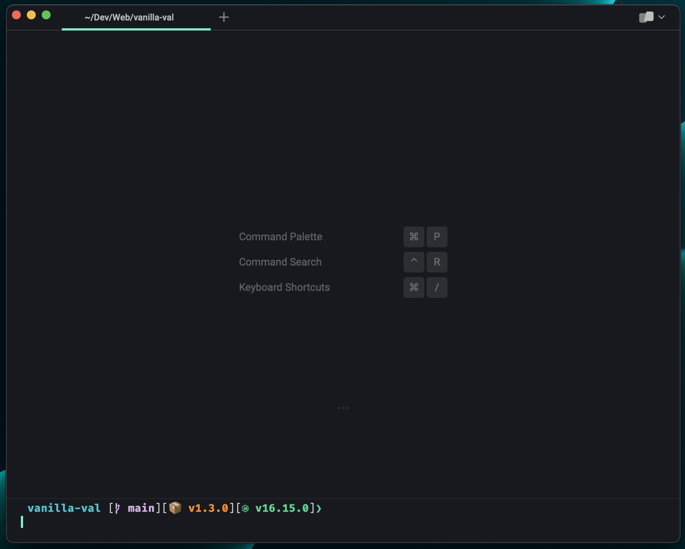

<div align="center">
  
  <h1>houston-terminal</h1>
</div>

<p align="center">
  A collection of terminal color profiles inspired by the <a href="https://github.com/withastro/houston-vscode">Houston VSCode theme</a>.
</p>

# Installation

## iTerm2


1. Download the `themes/Houston.itermcolors` file.
2. Open the preferences window in Iterm2. Under Profiles -> Colors, open the `Color Presets...` dropdown in the bottom right and select import.
3. After importing, you can set Houston as your theme from the same dropdown. 

## Warp



1. Download the `themes/houston.yaml` file.
2. Navigate to the directory you downloaded the yaml file to and run this command:

```bash
cp houston.yaml ~/.warp/themes/
```

3. Restart Warp. Navigate to Settings -> Appearance -> Theme and search for `Houston`. Select the theme and click the check mark in the bottom left.
   
   _You may need to create the `~/.warp/themes/` folder if you haven't already_

## Windows Terminal


1. Open the `themes/windows-terminal.json` file and copy the JSON object.
2. In Windows Terminal, go to Settings and click `Open JSON File` in the bottom left.
   
3. Paste the JSON object from step 1 into the `schemes` array of the JSON configuration file.
4. The Houston theme will now show up in the `Color schemes` section of Settings and is available to use on all of your terminal profiles.
